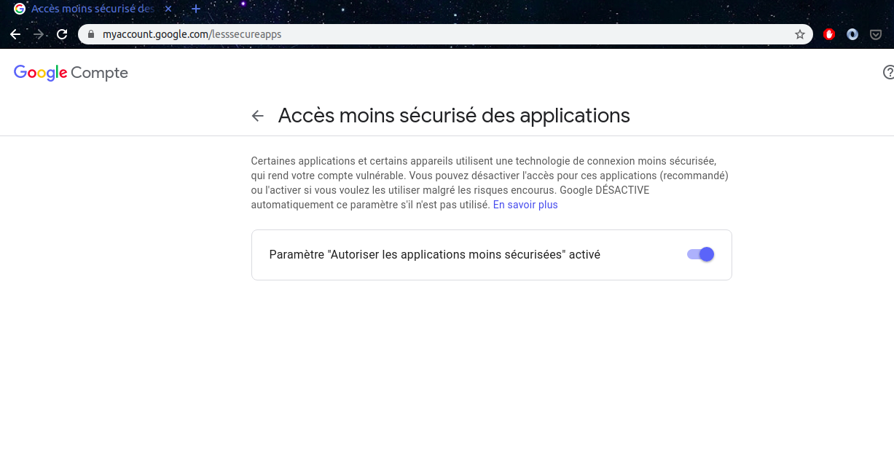

# BACKUP SYSTEM (DOC UTILISATEUR)

lien pour visualiser les readmes files : https://github.com/TahaAlamiIdrissi/backup-system/tree/master/testing-folder/DOC


Systéme de Sauvegarde automatique qui permet de selectionner des éléments (dossier ou autres) à inclure dans le processus de sauvegarde.

## Installation

Le projet peut etre cloné via 'la github repository' :https://github.com/TahaAlamiIdrissi/backup-system/ 

l'installation des modules ce fait en lançant le script install_all.sh . 
en précisant la version du gestionnaire de package (pip || pip3).

```bash
sudo ./install_all.sh pip 
```
or

```bash
sudo ./install_all.sh pip3
```
qui va installer les modules nécéssaire au bons fonctionement des scripts, ainsi que sshpass pour rsync.

Une fois cette étape finis,dans le fichier conF.py, devrait être précisé les informations de sauvegarde, comme par exemple:
- l'ip du serveur distant 
- le username et le password pour l'authentification au serveur distant
- le répértoire à sauvegarder 
- le répértoire ou la sauvegarde devrait ếtre faite. 

```python
Conf = {
    "ip": "<ip_du_serveur>",
    "username": "<username>",
    "password": "<password>",
    "folder": "<dir_a_sauvegarder>",
    "backup-folder":"<dir_ou_sauvegarder>"
}
```

et aussi les informations concernant le mailing

```python
smtpConf = {
    "mail":"<mail_de_reception>",
    "password": "<mot_de_passe>",
    "subject":"",
    "content":""
}
```
il faut aussi activer l'accés non sécurisé dans gmail comme le montre l'image suivantes.




## Lancement de l'utilitaire

(POUR TEST)
une fois toute les étapes de l'installation effectué l'utilitaire peut être lancé manuellement comme suit:

```bash
sudo ./run.sh
```
ou automatiquement via crontab 

Ouvrir un terminal :
```bash 
export EDITOR=<editeur_préfére> ; crontab -e
```
il suffit de modifier le fichier cronjobs.txt et de coller son contenue dans /var/spool/cron

```bash
min h j d m python <path_to_current_folder>/<script_of_your_choice> > <name_of_log_file>
59 23 * * * python /usr/src/backup/backupSFTP.py >> .logs/log_sftp
```

## License
[MIT](https://choosealicense.com/licenses/mit/)